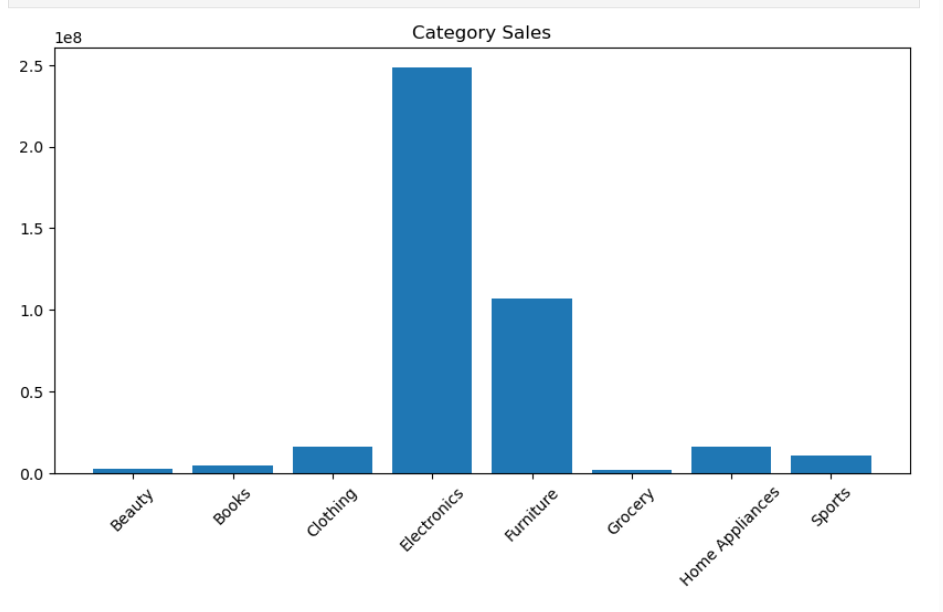
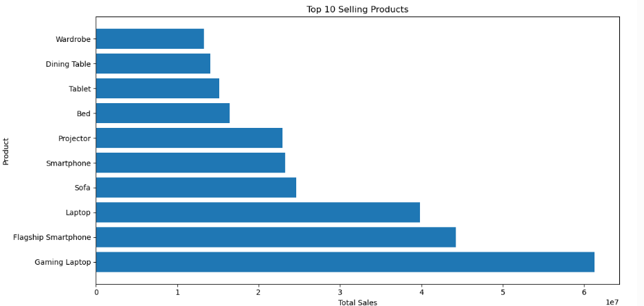
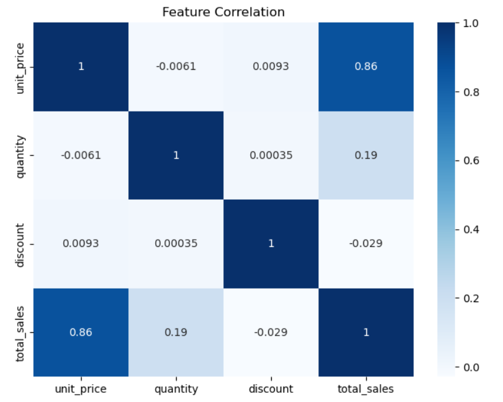
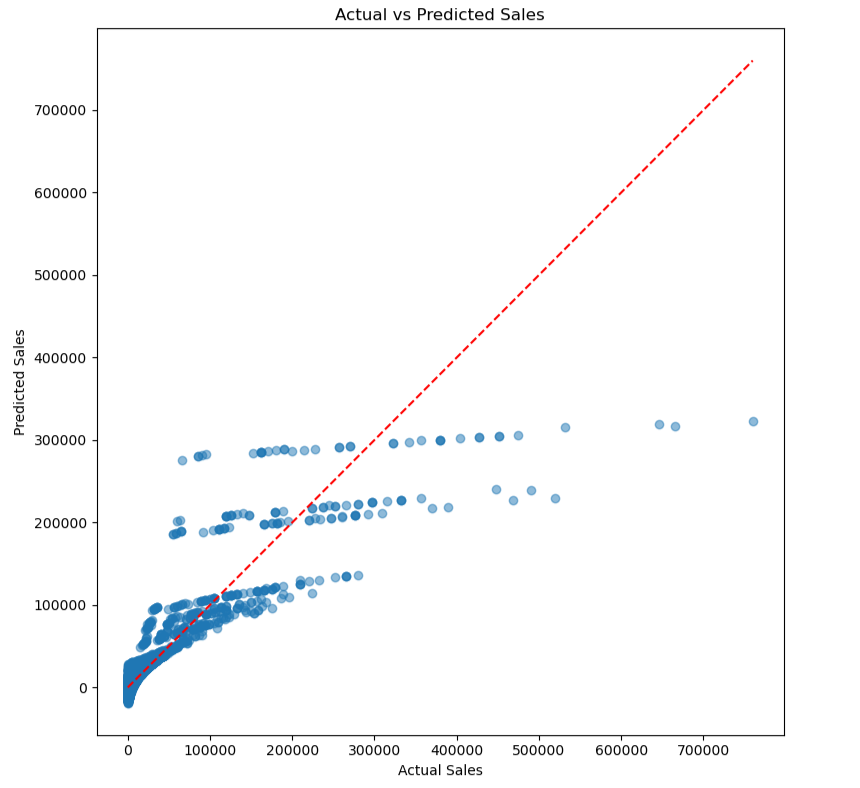

# 📈 Sales Forecasting AI
An end-to-end Machine Learning project that predicts sales using historical data stored in a MySQL database. The project demonstrates data generation, SQL integration, exploratory data analysis, and sales prediction using Python.

---

## 📸 Project Visualizations

### 📅 Monthly Sales Trend

Shows the total sales generated each month.


---

### 🛍️ Category-wise Sales

Displays total sales across different product categories.



---

### 🏆 Top 10 Selling Products

Highlights the products with the highest total sales.



---

### 🔥 Feature Correlation Heatmap

Shows the correlation between numerical features used in the project.



---

### 🤖 Actual vs Predicted Sales

Compares the Linear Regression model's predictions against the actual sales values.



---

## 🛠️ Tech Stack

- Python
- MySQL
- Pandas
- NumPy
- Matplotlib
- Scikit-learn
- Faker
- Jupyter Notebook
- Git & GitHub

---

## 📂 Project Structure

```text
Sales-Forecasting-AI/
│
├── assets/
│   ├── monthly_sales.png
│   ├── category_sales.png
│   ├── top_products.png
│   ├── correlation_heatmap.png
│   └── actual_vs_predicted.png
│
├── database/
│   ├── insert_products.py
│   ├── insert_customers.py
│   └── insert_sales.py
│
├── notebooks/
│   └── SalesForecasting.ipynb
│
├── create_tables.sql
├── requirements.txt
├── README.md
└── .gitignore
```

---

## 🚀 Key Features

- Synthetic sales data generation
- MySQL database integration
- SQL JOIN queries
- Data preprocessing using Pandas
- Exploratory Data Analysis (EDA)
- Sales trend visualization
- Linear Regression model for sales prediction
- Model evaluation and visualization

---

## 👨‍💻 Author

**Lohith Krishna**

Aspiring Software Engineer | AI Engineer

GitHub: https://github.com/LOHITH0901
